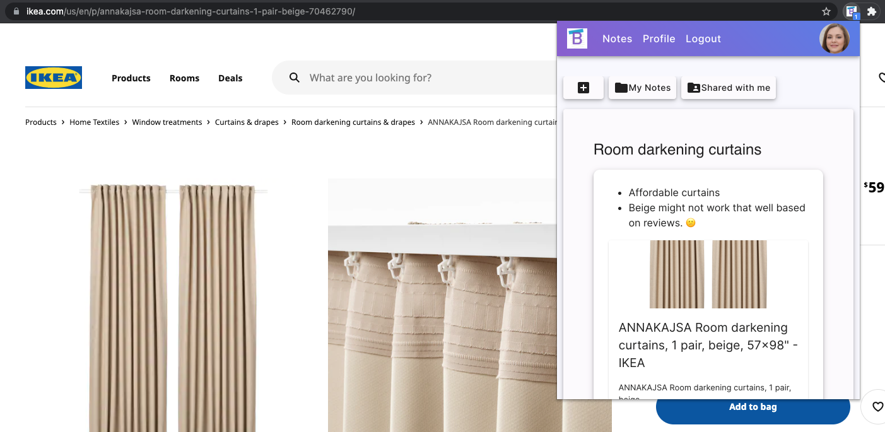
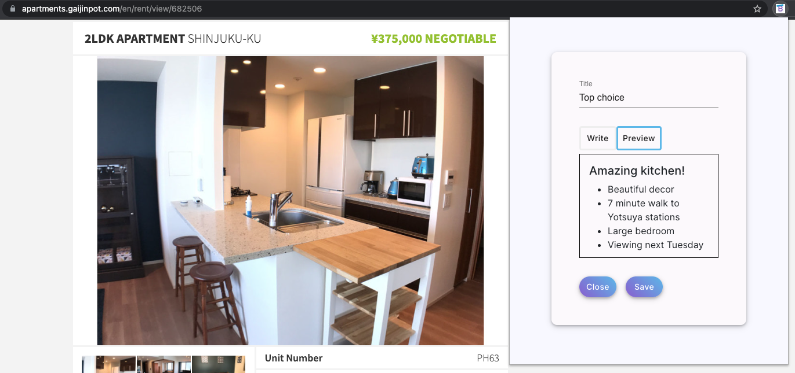
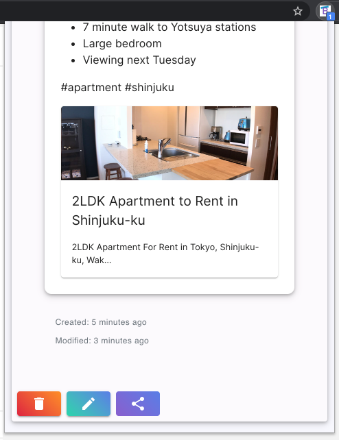

## Browsepad Chrome Extension

### Demo Video

<a href="https://github.com/Cury-Sohoni-Lau/browsepad">Browsepad Web App Repo</a>

### Getting started

`npm i` Install dependencies  
`npm run build`  

Go to Manage Extensions  
- Load unpacked
- Select the dist folder

### Who can use this app?
Anyone and everyone can use our app.

Does this sound like you?

- You're online shopping and you come across similar looking items.  You skim through the reviews and realize that the quality is not up to par. Some time later, you end up clicking on it again, only to realize that you already saw it. 

- You see a job description that looks amazing. Now, you have a list of several postings that you want to apply to, but forgot to write down your pros/cons and notes for each one. You end up spending more time reading through each one again. 

- You're hunting for an apartment, but can't remember what parts you liked/disliked from a certain listing. You accidentally click on an apartment that you already ruled out.

### What is it, exactly?
A web app and Chrome extension that allows you to write memos about specific web pages. Jot down your thoughts so that when you come back later, you know where you left off. 

### Where can I append memos? 
You can add memos to most sites, but we're still ironing out the kinks for some of the trickier ones. 

### When can I start using it?!
The web app is up and running (although, not on the final URL). Our initial release of the Chrome extension is on the <a href="https://chrome.google.com/webstore/detail/browsepad-extension/efeaahemcgmapoodfaniiginekegkllj">Chrome Web Store</a> (updated version to be released ASAP).

### Why is this open source?
This project is maintained by three software developers in Japan who are on their journeys to becoming working fullstack engineers. We believe in our product and the convenience it brings, so we want to share it with the world.   

